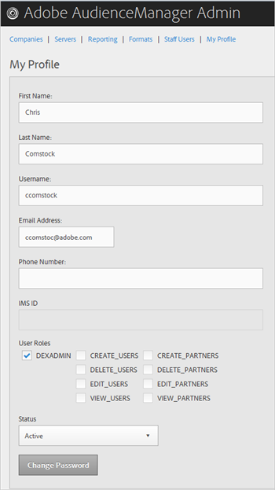

# Meu perfil {#my-profile}

Edite os detalhes do perfil de ferramenta Administrador do Audience Manager ou altere sua senha.

<!-- c_my_profile.xml -->

## Editar perfil {#edit-profile}

Exiba e edite o perfil de ferramenta Administrador do Audience Manager, incluindo nome e sobrenome, nome de usuário, endereço de email, número de telefone, [!UICONTROL IMS ID]funções do usuário e status.

<!-- t_edit_profile.xml -->

1. Clique em **[!UICONTROL My Profile]**.

   

2. Preencha os campos:
   * **[!UICONTROL First Name]:** (Obrigatório) Especifique seu primeiro nome.
   * **[!UICONTROL Last Name]:** (Obrigatório) Especifique o sobrenome.
   * **[!UICONTROL Username]:** (Obrigatório) Especifique seu primeiro nome de usuário.
   * **[!UICONTROL Email Address]:** (Obrigatório) Especifique seu endereço de email.
   * **[!UICONTROL Phone Number]:** Especifique o número de telefone.
   * **[!UICONTROL IMS ID]:** Especifique a ID do serviço de Internet Messaging.
   * **[!UICONTROL User Roles]:** Selecione as funções do usuário desejadas:
      * **[!UICONTROL DEXADMIN]:** Fornece ao administrador acesso para executar tarefas na ferramenta Administração do Audience Manager. Se você não selecionar essa opção, poderá escolher funções individuais. Essas funções permitem que os usuários executem tarefas usando [!DNL API] chamadas, mas não na ferramenta Administração.
      * **[!UICONTROL CREATE_USERS]:** Permite que os usuários criem novos usuários usando [!DNL API] uma chamada.
      * **[!UICONTROL DELETE_USERS]:** Permite que os usuários excluam usuários existentes usando [!DNL API] uma chamada.
      * **[!UICONTROL EDIT_USERS]:** Permite que os usuários editem usuários existentes usando [!DNL API] uma chamada.
      * **[!UICONTROL VIEW_USERS]:** Permite que os usuários visualizem outros usuários na configuração do Audience Manager usando [!DNL API] uma chamada.
      * **[!UICONTROL CREATE_PARTNERS]:** Permite que os usuários criem parceiros do Audience Manager usando [!DNL API] uma chamada.
      * **[!UICONTROL DELETE_PARTNERS]:** Permite que os usuários excluam os parceiros do Audience Manager usando [!DNL API] uma chamada.
      * **[!UICONTROL EDIT_PARTNERS]:** Permite que os usuários editem os parceiros do Audience Manager usando [!DNL API] uma chamada.
      * **[!UICONTROL VIEW_PARNTERS]:** Permite que os usuários visualizem os parceiros do Audience Manager usando [!DNL API] uma chamada.
   * **[!UICONTROL Status]:** Selecione o status desejado:
      * **[!UICONTROL Active]:** Especifica que esse usuário em um usuário ativo do Audience Manager.
      * **[!UICONTROL Deactivated]:** Especifica que esse usuário é um usuário desativado no Gerenciamento de público-alvo.
      * **[!UICONTROL Expired]:** Especifica que a conta do usuário no Audience Manager expirou.
      * **[!UICONTROL Locked Out]:** Especifica que a conta desse usuário no Audience Manager está bloqueada.
3. Clique em **[!UICONTROL Submit]**.

## Alterar senha {#change-password}

Altere a senha da ferramenta Administrador do Audience Manager.

<!-- t_change_password.xml -->

1. Clique em **[!UICONTROL My Profile]**.
1. Clique em **[!UICONTROL Change Password]**.

   

   A senha do Audience Manager deve ser:

   * Pelo menos oito caracteres de comprimento;
   * Contiver em um único caractere maiúsculo;
   * Contiver pelo menos um caractere minúsculo;
   * Contiver pelo menos um número;
   * Contiver pelo menos um caractere especial;
   * Começa e termine com um caractere alfanumérico;
   * Comece e termine com um caractere alfanumérico.

1. Especifique a senha antiga.
1. Especifique a nova senha e confirme a nova senha.
1. Clique em **[!UICONTROL OK]**.