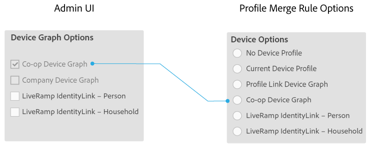

# Opções de gráfico de dispositivo para empresas {#device-graph-options-for-companies}

Os [!UICONTROL Device Graph Options] estão disponíveis para empresas que participam do [!DNL Adobe Experience Cloud Device Co-op]. Se um cliente também tiver uma relação contratual com um provedor de gráficos de dispositivos de terceiros integrado ao Audience Manager, esta seção mostrará opções para esse gráfico de dispositivos. Essas opções estão localizadas em [!UICONTROL Companies] > nome da empresa > [!UICONTROL Profile] > [!UICONTROL Device Graph Options].

Esta ilustração usa nomes genéricos para as opções de gráficos de dispositivos de terceiros. Na produção, esses nomes vêm do provedor de gráficos de dispositivos e podem variar do que é mostrado aqui. Por exemplo, as opções [!DNL LiveRamp] normalmente (mas nem sempre):

* Comece com &quot;[!DNL LiveRamp]&quot;
* Contém um nome do meio que varia
* Terminar com &quot;[!UICONTROL - Household]&quot; ou &quot;[!UICONTROL -Person]&quot;

## Definição das opções de gráfico do dispositivo {#device-graph-options-defined}

As opções de gráfico de dispositivos selecionadas aqui expõem ou ocultam as opções [!UICONTROL Device Options] disponíveis para um cliente [!DNL Audience Manager] quando eles criam um [!UICONTROL Profile Merge Rule].

### Gráfico de dispositivos cooperativos {#co-op-graph}

Os clientes que participam do [Adobe Experience Cloud Device Co-op](https://experienceleague.adobe.com/docs/device-co-op/using/about/overview.html?lang=en) usam essas opções para criar um [!UICONTROL Profile Merge Rule] com [dados determinísticos e probabilísticos](https://experienceleague.adobe.com/docs/device-co-op/using/device-graph/links.html?lang=en). O [!DNL Corporate Provisioning Team] ativa e desativa essa opção por meio de uma chamada [!DNL API] de back-end. Não é possível marcar ou desmarcar essas caixas no [!DNL Admin UI]. Além disso, as opções **[!UICONTROL Co-op Device Graph]** e **[!UICONTROL Company Device Graph]** são mutuamente exclusivas. Os clientes podem nos pedir para ativar um ou o outro, mas não ambos. Quando marcado, isso expõe o controle **[!UICONTROL Co-op Device Graph]** nas configurações [!UICONTROL Device Options] para um [!UICONTROL Profile Merge Rule].

### Gráfico de dispositivos da empresa {#company-graph}

Essa opção é para clientes [!DNL Analytics] que usam a métrica [!UICONTROL People] em seu conjunto de relatórios [!DNL Analytics]. O [!DNL Corporate Provisioning Team] ativa e desativa essa opção por meio de uma chamada [!DNL API] de back-end. Não é possível marcar ou desmarcar essas caixas no [!DNL Admin UI]. Além disso, as opções **[!UICONTROL Company Device Graph]** e **[!UICONTROL Co-op Device Graph]** são mutuamente exclusivas. Os clientes podem nos pedir para ativar um ou o outro, mas não ambos. Quando marcado:

* Este gráfico de dispositivos usa dados determinísticos que pertencem à empresa que você está configurando (sem dados probabilísticos).
* [!DNL Audience Manager] cria automaticamente um  [!UICONTROL Data Source] chamado nome de  `*`parceiro`*-Company Device Graph-Person`. Na página [!UICONTROL Data Source] de detalhes, [!DNL Audience Manager] os clientes podem alterar o nome do parceiro, a descrição e aplicar [Controles da exportação de dados](https://experienceleague.adobe.com/docs/device-co-op/using/device-graph/links.html?lang=en) a essa fonte de dados.
* [!DNL Audience Manager] Os clientes do  *não* veem uma nova configuração na  [!UICONTROL Device Options] seção para uma  [!UICONTROL Profile Merge Rule].

### Gráfico de dispositivos LiveRamp (Pessoa ou Família) {#liveramp-device-graph}

Essas caixas de seleção são ativadas no [!DNL Admin UI] quando um parceiro cria um [!UICONTROL Data Source] e seleciona **[!UICONTROL Use as an Authenticated Profile]** e/ou **[!UICONTROL Use as a Device Graph]**. Os nomes dessas configurações são determinados pelo provedor de gráficos de dispositivos de terceiros (por exemplo, [!DNL LiveRamp], [!DNL TapAd], etc.). Quando marcado, significa que a empresa que você está configurando usará os dados fornecidos por esses gráficos de dispositivos.

>[!MORELIKETHIS]
>
>* [Definição das opções da regra de mesclagem de perfis](https://experienceleague.adobe.com/docs/audience-manager/user-guide/features/profile-merge-rules/merge-rule-definitions.html?lang=en)
>* [Configurações da fonte de dados e opções do menu](https://experienceleague.adobe.com/docs/audience-manager/user-guide/features/data-sources/datasources-list-and-settings.html?lang=en)

